# Text formatting

## Typography

### Fonts

#### Bold font

The bold font is coded using the `<b></b>` pair:

¦ **Code:**

``` html
<b>Definition</b> 
```

¦ <b>Output:</b>

**Definition**

#### Italic font

The italic font is coded using the `<i></i>` pair:

¦ <b>Code:</b>

``` html
<i>Definition</i>
```

¦ **Output:**

*Definition*

#### Bold / Italic

The bold and italic fonts can be combined in a single instance:

¦ **Code:**

``` html
<b><i>Definition</i></b>
```

¦ **Output:**

***Definition***

### Underlined text

Underlined text is coded using the `<u></u>` pair:

¦ **Code:**

``` markdown
This area should be approached with <u>sensitivity</u>.
```

¦ **Output:**

This area should be approached with *sensitivity*.

## Indentation and spacing

### Line breaks

Line breaks are coded using the `<br>` format. It can be used repeatedly to make for several line breaks:

¦ **Code:**

``` html
Definition
<br> # one line break
Definition
<br><br> # two line breaks
Definition
```

¦ **Output:**


:::: custom-snippet
::: {.content-visible when-format="html"}

Definition<br>
Definition<br><br>
Definition

:::

::: {.content-visible when-format="pdf"}

Definition\ 

Definition

\vspace{1em}

Definition

:::

::: {.content-visible when-format="docx"}

```{=openxml}
<w:p>
  <w:r><w:t>Definition</w:t></w:r>
  <w:r><w:br/></w:r>
  <w:r><w:t>Definition</w:t></w:r>
  <w:r><w:br/><w:br/></w:r>
  <w:r><w:t>Definition</w:t></w:r>
</w:p>
```

:::
::::

### Padding

To create an indented (or "padded") block of text that works across all formats, you should use a fenced `Div` block with a custom padding-left style, like `<div style="padding-left:3em;">`.

¦ **Code:**

```  html
<b>Definition</b>

<div style="padding-left:3em;">
<b>F1a. Participation in social activities of long-standing interest</b> — The person engaged in social activities that have been of long-standing interest to him or her. The activities may be quite varied and should be counted as long as they involve interaction with at least one other person. Examples include attending meetings of informal clubs or religious services, playing bridge or bingo, volunteering at the local clothing bank, or gossiping with the neighbours on their front porches in the evening.
</div>
```

¦ **Output:**

::: {.content-visible when-format="html"}

<b>Definition</b>

<div style="padding-left:3em;">
<b>F1a. Participation in social activities of long-standing interest</b> — The person engaged in social activities that have been of long-standing interest to him or her. The activities may be quite varied and should be counted as long as they involve interaction with at least one other person. Examples include attending meetings of informal clubs or religious services, playing bridge or bingo, volunteering at the local clothing bank, or gossiping with the neighbours on their front porches in the evening.
</div>

:::

::: {.content-visible when-format="pdf"}

\noindent\textbf{Definition}

\vspace{0.5em}

\begin{flushleft}
\hspace*{3em}%
\begin{minipage}{\dimexpr\linewidth-3em}
\textbf{F1a. Participation in social activities of long-standing interest} —  
The person engaged in social activities that have been of long-standing interest to him or her. The activities may be quite varied and should be counted as long as they involve interaction with at least one other person. Examples include attending meetings of informal clubs or religious services, playing bridge or bingo, volunteering at the local clothing bank, or gossiping with the neighbours on their front porches in the evening.
\end{minipage}
\end{flushleft}

:::

::: {.content-visible when-format="docx"}

```{=openxml}
<w:p>
  <w:r>
    <w:rPr><w:b/></w:rPr>
    <w:t>Definition</w:t>
  </w:r>
</w:p>

<w:p>
  <w:pPr>
    <w:ind w:left="720"/> <!-- 720 twips = 0.5 inch indent -->
  </w:pPr>
  <w:r>
    <w:rPr><w:b/></w:rPr>
    <w:t>F1a. Participation in social activities of long-standing interest</w:t>
  </w:r>
  <w:r><w:t> — The person engaged in social activities that have been of long-standing interest to him or her. The activities may be quite varied and should be counted as long as they involve interaction with at least one other person. Examples include attending meetings of informal clubs or religious services, playing bridge or bingo, volunteering at the local clothing bank, or gossiping with the neighbours on their front porches in the evening.</w:t></w:r>
</w:p>
```
:::

### Center / left / right positioned text

Text can be centered by using the `<div style="text-align: center;">` tag. This is particularly useful in boxes and tables:

¦ **Code:**

``` html
<div style="text-align: center;">This is an example of a centered text</div>
```

¦ **Output:**

::: {.content-visible when-format="html"}

<div style="text-align: center;">This is an example of a centered text</div>

:::

::: {.content-visible when-format="pdf"}

\begin{center}
This is an example of a centered text
\end{center}

:::

::: {.content-visible when-format="docx"}

```{=openxml}
<w:p>
  <w:pPr>
    <w:jc w:val="center"/> <!-- center alignment -->
  </w:pPr>
  <w:r>
    <w:t>This is an example of a centered text</w:t>
  </w:r>
</w:p>
```
:::

Placing the text to the left `<div style="text-align: left;">` or to the right `<div style="text-align: right;">` follows the same logic:

¦ **Code:**

``` html
<div style="text-align: left;">This is an example of a left aligned text</div>
<br><br>
<div style="text-align: right;">This is an example of a right aligned text</div>
```

¦ **Output:**

::: {.content-visible when-format="html"}

<div style="text-align: left;">This is an example of a left aligned text</div>
<br><br>
<div style="text-align: right;">This is an example of a right aligned text</div>

:::

::: {.content-visible when-format="pdf"}
\begin{flushleft}
This is an example of a left aligned text
\end{flushleft}

\begin{flushright}
This is an example of a right aligned text
\end{flushright}
:::


::: {.content-visible when-format="docx"}
```{=openxml}
<w:p>
  <w:pPr>
    <w:jc w:val="left"/>
  </w:pPr>
  <w:r>
    <w:t>This is an example of a left aligned text</w:t>
  </w:r>
</w:p>
<w:p>
  <w:pPr>
    <w:jc w:val="right"/>
  </w:pPr>
  <w:r>
    <w:t>This is an example of a right aligned text</w:t>
  </w:r>
</w:p>
```
:::

### Blank spaces

Blank spaces can be added when needed. To code a blank space we use "&nbsp;":

¦ **Code:**

``` html
&nbsp;
```

Blank spaces can be put together in the same way as line breaks (this is helpful when writing dates):

``` html
Example: 01.03.1942<br><br>
[ 0 ][ 1 ]&nbsp;&nbsp;[ 0 ][ 3 ]&nbsp;&nbsp; [ 1 ][ 9 ][ 4 ][ 2 ]<br>

 Day &nbsp;&nbsp;&nbsp; Month &nbsp;&nbsp;&nbsp; Year
```

¦ **Output:**

::: {.content-visible when-format="html"}
Example: 01.03.1942<br><br>
<span style="display: inline-block; width: 9ch; text-align: center;">[ 0 ][ 1 ]</span><span style="display: inline-block; width: 9ch; text-align: center;">[ 0 ][ 3 ]</span>&nbsp;&nbsp;&nbsp;&nbsp;&nbsp;<span style="display: inline-block; width: 15ch; text-align: center;">[ 1 ][ 9 ][ 4 ][ 2 ]</span><br>
<span style="display: inline-block; width: 9ch; text-align: center;">Day</span><span style="display: inline-block; width: 9ch; text-align: center;">Month</span>&nbsp;&nbsp;&nbsp;&nbsp;&nbsp;<span style="display: inline-block; width: 15ch; text-align: center;">Year</span>

:::

::: {.content-visible when-format="pdf"}
Example: 01.03.1942\
\begin{tabular}{c@{\hspace{3em}}c@{\hspace{2.5em}}c}
\texttt{[ 0 ][ 1 ]} & \texttt{[ 0 ][ 3 ]} & \texttt{[ 1 ][ 9 ][ 4 ][ 2 ]} \\
Day & Month & Year
\end{tabular}
:::

::: {.content-visible when-format="docx"}

Example: 01.03.1942

|   |   |   |
|:---:|:---:|:---:|
| [ 0 ] [ 1 ] | [ 0 ] [ 3 ] | [ 1 ] [ 9 ] [ 4 ] [ 2 ] |
| Day | Month | Year |

:::

## Lists

Lists can be ordered (using numbers for every section) or unordered (using bullets only).

### Unordered lists (bullet list)

Unordered lists are coded using the `<ul></ul>` pair. Each section (or row) is marked with `<li></li>`:

¦ **Code:**

``` html

This area should be approached with sensitivity. The recording of the response should not reflect what you believe may have occurred but rather what the person or the record indicates.
<ul>
<li><b>G1d.  	Victim of physical assault or abuse</b> — Any form of physical abuse experienced by the person, regardless of his or her age when the incident(s) occurred (for example, any incident resulting in non-accidental injury, physical confinement, excessive physical discipline, or withdrawal of necessities of life, such as food and shelter).</li>
<br>
<li><b>G1e.	Victim of emotional abuse</b> — Person has been in a pervasive and hostile emotional environment created by an abuser for the purposes of control. The abused person’s self-esteem, identity, energy, ability to feel and question, wants, and needs are invalidated by the abuser.</li>
</ul>
```

¦ **Output:**

:::: custom-snippet
::: {.content-visible when-format="html"}
This area should be approached with sensitivity. The recording of the response should not reflect what you believe may have occurred but rather what the person or the record indicates.

<ul>

<li><b>G1d. Victim of physical assault or abuse</b> — Any form of physical abuse experienced by the person, regardless of his or her age when the incident(s) occurred (for example, any incident resulting in non-accidental injury, physical confinement, excessive physical discipline, or withdrawal of necessities of life, such as food and shelter).</li>


<li><b>G1e. Victim of emotional abuse</b> — Person has been in a pervasive and hostile emotional environment created by an abuser for the purposes of control. The abused person’s self-esteem, identity, energy, ability to feel and question, wants, and needs are invalidated by the abuser.</li>

</ul>

:::

::: {.content-visible when-format="pdf"}
\noindent
This area should be approached with sensitivity. The recording of the response should not reflect what you believe may have occurred but rather what the person or the record indicates.

\vspace{0.8em}

\begin{itemize}
  \item \textbf{G1d. Victim of physical assault or abuse} --- Any form of physical abuse experienced by the person, regardless of his or her age when the incident(s) occurred (for example, any incident resulting in non-accidental injury, physical confinement, excessive physical discipline, or withdrawal of necessities of life, such as food and shelter).
  
  \vspace{0.5em}
  
  \item \textbf{G1e. Victim of emotional abuse} --- Person has been in a pervasive and hostile emotional environment created by an abuser for the purposes of control. The abused person’s self-esteem, identity, energy, ability to feel and question, wants, and needs are invalidated by the abuser.
\end{itemize}
:::

::: {.content-visible when-format="docx"}
```{=openxml}
<w:p>
  <w:r>
    <w:t>This area should be approached with sensitivity. The recording of the response should not reflect what you believe may have occurred but rather what the person or the record indicates.</w:t>
  </w:r>
</w:p>
<w:p>
  <w:pPr>
    <w:numPr>
      <w:ilvl w:val="0"/>
      <w:numId w:val="1"/>
    </w:numPr>
  </w:pPr>
  <w:r>
    <w:rPr>
      <w:b/>
    </w:rPr>
    <w:t>G1d.  Victim of physical assault or abuse</w:t>
  </w:r>
  <w:r>
    <w:t> — Any form of physical abuse experienced by the person, regardless of his or her age when the incident(s) occurred (for example, any incident resulting in non-accidental injury, physical confinement, excessive physical discipline, or withdrawal of necessities of life, such as food and shelter).</w:t>
  </w:r>
</w:p>
<w:p/>
<w:p>
  <w:pPr>
    <w:numPr>
      <w:ilvl w:val="0"/>
      <w:numId w:val="1"/>
    </w:numPr>
  </w:pPr>
  <w:r>
    <w:rPr>
      <w:b/>
    </w:rPr>
    <w:t>G1e. Victim of emotional abuse</w:t>
  </w:r>
  <w:r>
    <w:t> — Person has been in a pervasive and hostile emotional environment created by an abuser for the purposes of control. The abused person’s self-esteem, identity, energy, ability to feel and question, wants, and needs are invalidated by the abuser.</w:t>
  </w:r>
</w:p>
```
:::
::::


### Ordered lists

Ordered lists add a consecutive number (starting from '1') to every block of the list. The code for ordered list is the `<ol></ol>` pair and every block is marked with the `<li></li>` pair, same as with unordered lists:

¦ **Code:**

``` html
This area should be approached with sensitivity. The recording of the response should not reflect what you believe may have occurred but rather what the person or the record indicates.
<ol>
<li><b>Victim of physical assault or abuse</b> — Any form of physical abuse experienced by the person, regardless of his or her age when the incident(s) occurred (for example, any incident resulting in non-accidental injury, physical confinement, excessive physical discipline, or withdrawal of necessities of life, such as food and shelter).</li>
<br>
<li><b>Victim of emotional abuse</b> — Person has been in a pervasive and hostile emotional environment created by an abuser for the purposes of control. The abused person’s self-esteem, identity, energy, ability to feel and question, wants, and needs are invalidated by the abuser.</li>
</ol>
```

¦ **Output:**

:::: custom-snippet
::: {.content-visible when-format="html"}
This area should be approached with sensitivity. The recording of the response should not reflect what you believe may have occurred but rather what the person or the record indicates.

<ol>

<li><b>Victim of physical assault or abuse</b> — Any form of physical abuse experienced by the person, regardless of his or her age when the incident(s) occurred (for example, any incident resulting in non-accidental injury, physical confinement, excessive physical discipline, or withdrawal of necessities of life, such as food and shelter).</li>


<li><b>Victim of emotional abuse</b> — Person has been in a pervasive and hostile emotional environment created by an abuser for the purposes of control. The abused person’s self-esteem, identity, energy, ability to feel and question, wants, and needs are invalidated by the abuser.</li>

</ol>

:::

::: {.content-visible when-format="pdf"}
\noindent
This area should be approached with sensitivity. The recording of the response should not reflect what you believe may have occurred but rather what the person or the record indicates.

\vspace{0.8em}

\begin{enumerate}
  \item \textbf{G1d. Victim of physical assault or abuse} --- Any form of physical abuse experienced by the person, regardless of his or her age when the incident(s) occurred (for example, any incident resulting in non-accidental injury, physical confinement, excessive physical discipline, or withdrawal of necessities of life, such as food and shelter).
  
  \vspace{0.5em}
  
  \item \textbf{G1e. Victim of emotional abuse} --- Person has been in a pervasive and hostile emotional environment created by an abuser for the purposes of control. The abused person’s self-esteem, identity, energy, ability to feel and question, wants, and needs are invalidated by the abuser.
\end{enumerate}
:::

::: {.content-visible when-format="docx"}
This area should be approached with sensitivity. The recording of the response should not reflect what you believe may have occurred but rather what the person or the record indicates.

1. **Victim of physical assault or abuse**— Any form of physical abuse experienced by the person, regardless of his or her age when the incident(s) occurred (for example, any incident resulting in non-accidental injury, physical confinement, excessive physical discipline, or withdrawal of necessities of life, such as food and shelter).

2. **Victim of emotional abuse**— Person has been in a pervasive and hostile emotional environment created by an abuser for the purposes of control. The abused person’s self-esteem, identity, energy, ability to feel and question, wants, and needs are invalidated by the abuser.
:::
::::

# Boxes and tables

Boxes and tables are special ways to present information that the author wants to be put into perspective (by comparing items by row and column) or that is specially important and needs to stand out from the rest of the text.

## Boxes

A box is coded using the `<div class="box"></div>` tag. This creates a standard box enclosing the text:

¦ **Code:**

``` html
<div class="box">
    <div style="text-align: center;">Example of How to Code Life Events
    </div>
</div>
```

¦ **Output:**

:::: custom-snippet
::: {.content-visible when-format="html"}
::: {style="border: 1px solid #000; padding: 20px; margin: 20px auto; max-width: 85%; display: flex; justify-content: center; align-items: center;"}
Example of How to Code Life Events
:::
:::

::: {.content-visible when-format="pdf"}
\begin{center}
\fbox{%
  \parbox{0.85\linewidth}{%
    \centering
    Example of How to Code Life Events
  }%
}
\end{center}
:::

::: {.content-visible when-format="docx"}
```{=openxml}
<w:p>
  <w:pPr>
    <w:pBdr>
      <w:top w:val="single" w:sz="4" w:space="4" w:color="auto"/>
      <w:left w:val="single" w:sz="4" w:space="4" w:color="auto"/>
      <w:bottom w:val="single" w:sz="4" w:space="4" w:color="auto"/>
      <w:right w:val="single" w:sz="4" w:space="4" w:color="auto"/>
    </w:pBdr>
    <w:jc w:val="center"/>
  </w:pPr>
  <w:r>
    <w:t>Example of How to Code Life Events</w:t>
  </w:r>
</w:p>
```
:::
::::


## Tables

A table is composed of columns and rows. Rows are coded with `<tr></tr>` and each row can have several cells in succession, one for each column, using `<td></td>` to mark each cell. If the user wants the top cell to act as a header, then the code for the cell changes to `<th></th>`. If needed, the length of a cell can be changed using `colspan="3"` with the desired width, counting in numbers of cells that that particular cell spans (by changing the number '3'). The width of the row can be defined using `rowspan="2"` also with the desired number of cells on the row that the cell in question will span. In practice, it is coded like this:

¦ **Code:**

``` html
<table border="1">
  <tr>
    <th>Morning</th>
    <th>Afternoon</th>
    <th colspan="3">Night</th>
  </tr>
  <tr>
    <td rowspan="2">Make bed</td>
    <td>Visit to doctor</td>
    <td colspan="3">Socialize</td>
  </tr>
  <tr>
    <td>Grocery shopping</td>
    <td>Watch movie</td>
    <td>Read</td>
    <td>Sleep</td>
  </tr>
</table>
```

¦ **Output:**

:::: custom-snippet
::: {.content-visible when-format="html"}

<table border="1">
  <tr>
    <th>Morning</th>
    <th>Afternoon</th>
    <th colspan="3">Night</th>
  </tr>
  <tr>
    <td rowspan="2">Make bed</td>
    <td>Visit to doctor</td>
    <td colspan="3">Socialize</td>
  </tr>
  <tr>
    <td>Grocery shopping</td>
    <td>Watch movie</td>
    <td>Read</td>
    <td>Sleep</td>
  </tr>
</table>

:::

::: {.content-visible when-format="pdf"}
\begin{table}[h]
\centering
\begin{tabular}{|c|c|c|c|c|}
\hline
\textbf{Morning} & \textbf{Afternoon} & \multicolumn{3}{c|}{\textbf{Night}} \\
\hline
Make bed & Visit to doctor & \multicolumn{3}{c|}{Socialize} \\
\hline
Make bed & Grocery shopping & Watch movie & Read & Sleep \\
\hline
\end{tabular}
\end{table}
:::

::: {.content-visible when-format="docx"}
```{=openxml}
<w:tbl>
  <w:tblPr>
    <w:tblBorders>
      <w:top w:val="single" w:sz="4" w:space="0" w:color="auto"/>
      <w:left w:val="single" w:sz="4" w:space="0" w:color="auto"/>
      <w:bottom w:val="single" w:sz="4" w:space="0" w:color="auto"/>
      <w:right w:val="single" w:sz="4" w:space="0" w:color="auto"/>
      <w:insideH w:val="single" w:sz="4" w:space="0" w:color="auto"/>
      <w:insideV w:val="single" w:sz="4" w:space="0" w:color="auto"/>
    </w:tblBorders>
  </w:tblPr>
  <w:tblGrid>
    <w:gridCol w:w="1200"/>
    <w:gridCol w:w="1200"/>
    <w:gridCol w:w="1200"/>
    <w:gridCol w:w="1200"/>
    <w:gridCol w:w="1200"/>
  </w:tblGrid>
  <w:tr>
    <w:tc>
      <w:p>
        <w:r>
          <w:rPr><w:b/></w:rPr>
          <w:t>Morning</w:t>
        </w:r>
      </w:p>
    </w:tc>
    <w:tc>
      <w:p>
        <w:r>
          <w:rPr><w:b/></w:rPr>
          <w:t>Afternoon</w:t>
        </w:r>
      </w:p>
    </w:tc>
    <w:tc>
      <w:tcPr>
        <w:gridSpan w:val="3"/>
      </w:tcPr>
      <w:p>
        <w:r>
          <w:rPr><w:b/></w:rPr>
          <w:t>Night</w:t>
        </w:r>
      </w:p>
    </w:tc>
  </w:tr>
  <w:tr>
    <w:tc>
      <w:p>
        <w:r>
          <w:t>Make bed</w:t>
        </w:r>
      </w:p>
    </w:tc>
    <w:tc>
      <w:p>
        <w:r>
          <w:t>Visit to doctor</w:t>
        </w:r>
      </w:p>
    </w:tc>
    <w:tc>
      <w:tcPr>
        <w:gridSpan w:val="3"/>
      </w:tcPr>
      <w:p>
        <w:r>
          <w:t>Socialize</w:t>
        </w:r>
      </w:p>
    </w:tc>
  </w:tr>
  <w:tr>
    <w:tc>
      <w:p>
        <w:r>
          <w:t>Make bed</w:t>
        </w:r>
      </w:p>
    </w:tc>
    <w:tc>
      <w:p>
        <w:r>
          <w:t>Grocery shopping</w:t>
        </w:r>
      </w:p>
    </w:tc>
    <w:tc>
      <w:p>
        <w:r>
          <w:t>Watch movie</w:t>
        </w:r>
      </w:p>
    </w:tc>
    <w:tc>
      <w:p>
        <w:r>
          <w:t>Read</w:t>
        </w:r>
      </w:p>
    </w:tc>
    <w:tc>
      <w:p>
        <w:r>
          <w:t>Sleep</w:t>
        </w:r>
      </w:p>
    </w:tc>
  </w:tr>
</w:tbl>
```
:::
::::

# General guidelines

## Format

### Aesthetic rules

#### Structure of the sections

The manual is usually structured in several sections that follow a regular pattern. To speed up the process of transferring the contents of the interRAI manual into the tool, it is advisable to create a skeleton schema on a text editor (like Notepad++). An example of this schema for the English language would be the following:

¦ **Code:**

``` html
<b>Title</b><br><br>

<b>Intent</b>
<div style="padding-left:3em;">
</div><br>

<b>Definitions</b>
<div style="padding-left:3em;">
    <b></b>
</div><br>

<b>Process</b>
<div style="padding-left:3em;">
    <b></b>
</div><br>

<b>Coding</b>
<div style="padding-left:3em;">
</div>
```

This schema is generally observed on all interRAI manuals across the multiple localizations for language and country. It is a common feature for all the instruments, regardless of the version or intended population. Not all the sections on the schema are used on some items on the manual, but the order of the sections is usually preserved.

#### Visual harmonization

As the interRAI manuals are used in several countries across different languages, it is only natural that some manuals differ in terms of paragraph positioning, font, capitalization, text structure... etc.

To achieve a homogeneous appearance across manuals, it is important to put some common rules in place to settle any differences in style. The purpose of this guide is to document these rules and to be used as a reference.

#### Titles, headings and sub-headings

The manuals are usually provided as a word document and have a general introduction presenting the purpose of the interRAI manuals in general, the intended use for this specific instrument on the target population, an eventual localization on multilingual countries and an index detailing the contents of the document.

All these sections are not reflected on the user interface version of the manual via the Manual Editor tool, but are visible on the pdf document uploaded to the documentation section. The Manual Editor usually starts on Section A (sometimes AA) of the manual. The headings and sub-headings of this section are not to be transcribed onto the Manual Editor.

So, for example, this section of the manual on the source document appears like this:

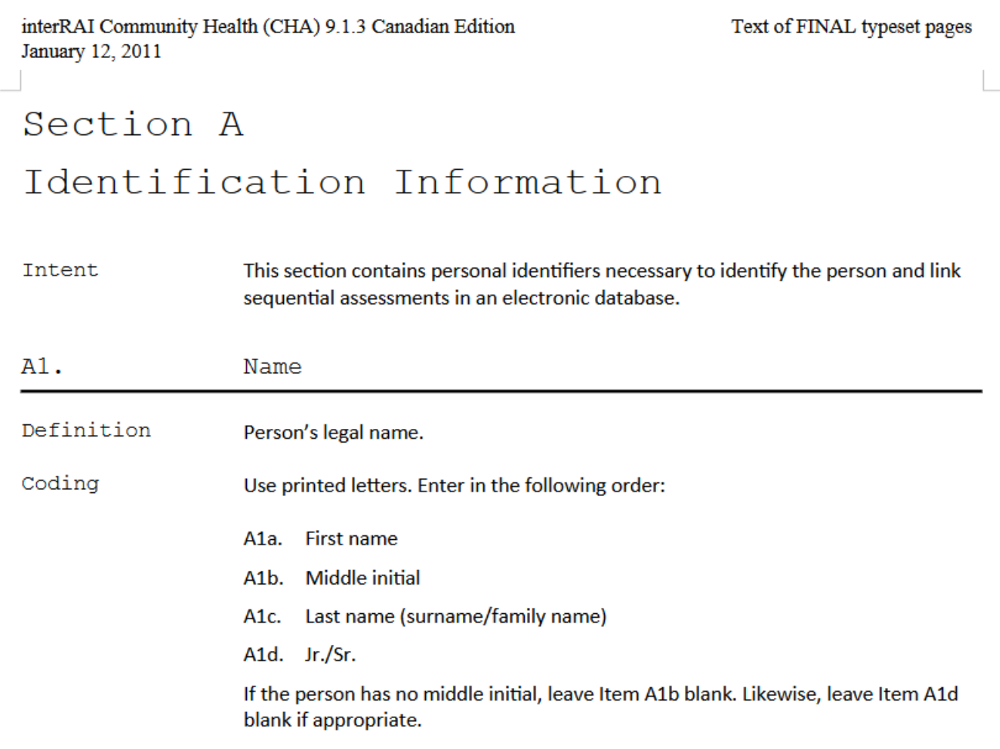



However, there is no need to include the headings. On the manual, this section looks like this:

¦ **Code:**

``` html
<b>A1. Name</b>
<br><br>

<b>Definition</b>
<div style="padding-left:3em;">
    Person’s legal name.
</div>
<br>

<b>AA1 Name of Client</b><br><br>
<b>Intent</b>
<div style="padding-left:3em;">
    To record the name of the client receiving services from the home
    care agency.
</div><br>
<b>Definition</b>
<div style="padding-left:3em;">
    Client’s legal name, which represents the full name of the person.
</div><br>

<b>Coding</b>
<div style="padding-left:3em;">
    Use printed letters. Enter in the following order: <br><br>
    <b>a. Last/Family Name,</b><br>
    <b>b. First Name,</b><br>
    <b>c. Middle Name/Initial.</b><br>
    <br>
    If the client has no middle initial, leave item “c” blank.
</div>
```


¦ **Output:**

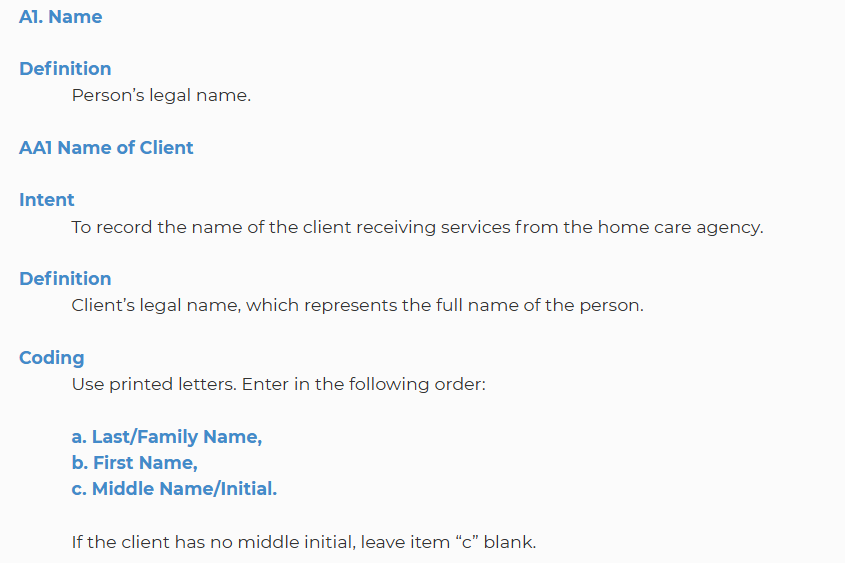


### Spacing between paragraphs

This part is particularly tricky: when inserting code onto the Manual Editor tool, the visualization functionality that gives a preview of how the page will look like on the user interface can be somewhat misleading. It is possible to get the impression that the paragraphs between a section are closer or further away than they really are. This is the case, for example, when inserting spaces after a list, a box or a table.

To get a coherent look on all the manuals, please adhere to the following rules when separating paragraphs:

-   Always use one `<br>` space to separate lines and two `<br><br>` spaces to separate paragraphs if the paragraph is not the last one before the closing `<div></div>` tag when using the padding style. If the paragraph ends with `</div>` then use `</div><br>` instead of `<div><br><br>` to separate the next paragraph.

¦ **Example code:**

``` html
<b>Coding</b>
<div style="padding-left:3em;">
    <b>M. Male</b><br>
    <b>F. Female</b><br>
    <b>UN. Not assigned male or female</b>
</div><br>
This is a text that only serves to demonstrate the space between the list and the following lines.
```

¦ **Output:**


-   If a new paragraph begins after the end of a list with padding style `<div style="padding-left:3em;"></div>` there is no need to use a single `<br>` space after the end of the list `<ul></ul>` or `<ol></ol>` or after `</div>` if no text is placed between `</ol>` and `</div>` as the browser will automatically make a space, and putting a space here would make the separation too wide.

¦ **Example code:**

``` html
<b>A4. Marital Status</b>
<br><br>

<b>Coding</b>
<div style="padding-left:3em;">
Choose the answer that describes the current marital status of the person. If the person is in a common-law relationship, score the item “<b>2</b>” for “Married”. If the person is in a same-sex relationship that is legally recognized as a marriage, score the item “<b>2</b>” for “Married”. If the person is in a long-term same-sex relationship that is not legally recognized as a marriage, score the item “<b>3</b>” for “Partner/significant other”.
<br>

<ol>
  <li><b>Never married</b></li>
  <li><b>Married</b></li>
  <li><b>Partner/Significant other</b></li>
  <li><b>Widowed</b></li>
  <li><b>Separated</b></li>
  <li><b>Divorced</b></li>
</ol>
</div>
This is a text that only serves to demonstrate the space between the list and the following lines.
```

¦ **Output:**

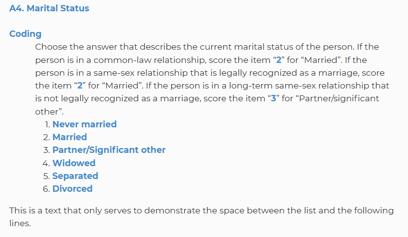


### Ordered and unordered lists

Lists will result in a different formatting on the browser, as opposed to simply using bullets or numbering paragraphs.

-   **Ordered list vs numbered paragraph** If an ordered list is created after a padded paragraph, the list will have an added indentation with respect to the same text that is using only paragraphs with numbers.

¦ **Example code:**

``` html
<b>A8. Reason for Assessment</b>
<br><br>

<b>Intent</b>
<div style="padding-left:3em;">
To document the reason for completing the assessment. 
</div>
<br>

<b>Coding</b>
<div style="padding-left:3em;">
Enter the number corresponding to the reason for assessment.
<br><br>

<b>1. 	First assessment</b> — An assessment that is done at the time of entry into the home care system, or when initially determining eligibility for home care/home health services.
<br><br>

<b>2. 	Routine reassessment</b> — A regularly scheduled follow-up assessment to ensure that the care plan is appropriate and current.
<br><br>

</div>
<br>
```


¦ **Output:**


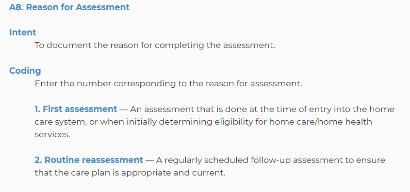


As seen on the example, the padded text after 'Coding' has the same indentation as the numbered paragraphs.

If we were to use an ordered list on the same text, we would get the following:

¦ **Code:**

``` html
<b>A8. Reason for Assessment</b>
<br><br>

<b>Intent</b>
<div style="padding-left:3em;">
To document the reason for completing the assessment. 
</div>
<br>

<b>Coding</b>
<div style="padding-left:3em;">
Enter the number corresponding to the reason for assessment.
<br><br>

<ol>
  <li><b>First assessment</b> — An assessment that is done at the time of entry into the home care system, or when initially determining eligibility for home care/home health services.</li><br>

  <li><b>Routine reassessment</b> — A regularly scheduled follow-up assessment to ensure that the care plan is appropriate and current.</li><br>

  <li><b>Return assessment</b> — An assessment conducted when the person returns from the hospital or re-enters the home care system after a planned absence.</li><br>
</ol>
</div>
<br>
```
\pagebreak

¦ **Output:**

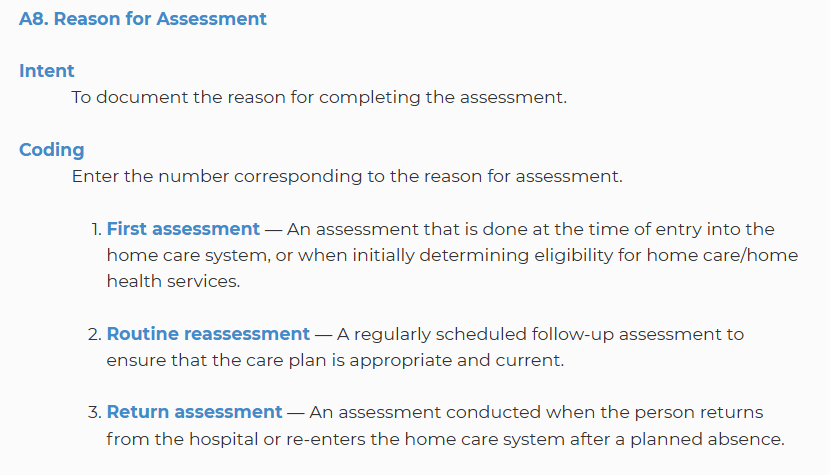

Now the list appears nested under the padded text, with the text displaying three degrees of indentation.

-   When to use an ordered list:

As the occurrence of numbered paragraphs is high on the source text, and ordered lists impose a certain formatting, it is recommended to abstain from using an ordered list when the paragraphs on the source text are ordered using numbers. Furthermore, sometimes it is the case that a paragraph has a numbered list, but the options on the list do not follow a consecutive logic (as in the case of 0, 1, 2, 3, and 8). For all these reasons, numbered paragraphs are preferred to ordered lists.

An ordered list could be used when nested inside a section containing only the list itself, without additional padded text, for example here:

¦ **Code:**

``` html
<b>Coding</b>
<ol>
  <li><b>First assessment</b> — An assessment that is done at the time of entry into the home care system, or when initially determining eligibility for home care/home health services.</li><br>

  <li><b>Routine reassessment</b> — A regularly scheduled follow-up assessment to ensure that the care plan is appropriate and current.</li><br>

  <li><b>Return assessment</b> — An assessment conducted when the person returns from the hospital or re-enters the home care system after a planned absence.</li><br>
  </ol>
</div>
<br>
```

¦ **Output:**

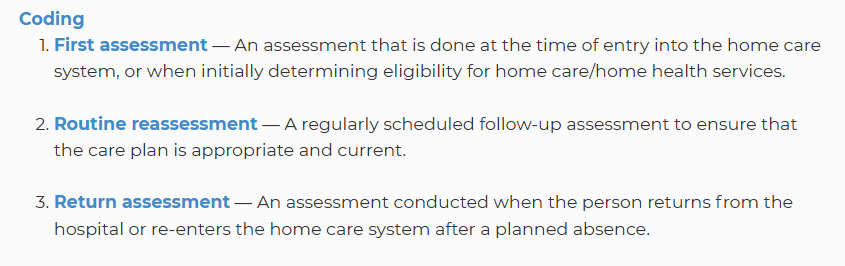

-   Use of spaces after items on a list or numbered paragraph

Usually, numbered paragraphs will contain several lines as rendered on the Manual Editor tool or the typical browser window (normally over 1024 pixels). These long numbered paragraphs need to be separated using two spaces `<br><br>` or a single space after the end of list item marker `</li><br>` as seen in the code examples before.

However, short numbered items should use only one space `<br>` and short lists items should not contain any spaces (the end of item marker `</li>` is enough to get the separation needed for the list). Here are some examples of both:

-   A short numbered paragraph

¦ **Code:**

``` html
# Here is an example of a short numbered paragraph
<b>A4. Marital Status</b>
<br><br>

<b>Coding</b>
<div style="padding-left:3em;">
Choose the answer that describes the current marital status of the person. If the person is in a common-law relationship, score the item “<b>2</b>” for “Married”. If the person is in a same-sex relationship that is legally recognized as a marriage, score the item “<b>2</b>” for “Married”. If the person is in a long-term same-sex relationship that is not legally recognized as a marriage, score the item “<b>3</b>” for “Partner/significant other”.
<br><br>

<b>1.	Never married</b><br>
<b>2.	Married</b><br>
<b>3.   Partner / Significant other</b><br>
<b>4.	Widowed</b><br>
<b>5.	Separated</b><br>
<b>6.	Divorced</b>
</div>
<br>
```


¦ **Output:**

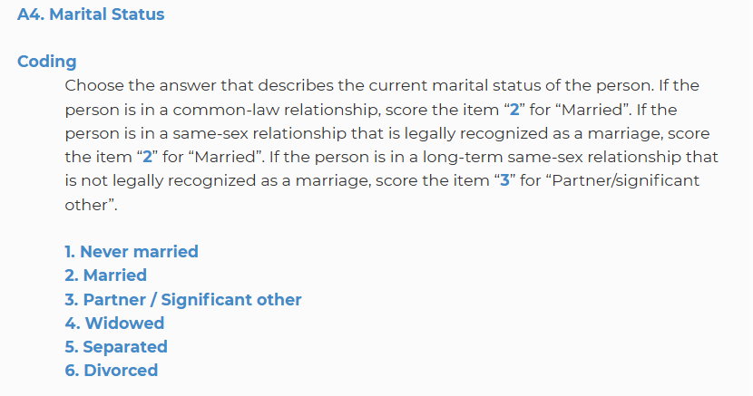

-   The same short paragraph in list form

¦ **Code:**

``` html
<b>A4. Marital Status</b>
<br><br>

<b>Coding</b>
<div style="padding-left:3em;">
Choose the answer that describes the current marital status of the person. If the person is in a common-law relationship, score the item “<b>2</b>” for “Married”. If the person is in a same-sex relationship that is legally recognized as a marriage, score the item “<b>2</b>” for “Married”. If the person is in a long-term same-sex relationship that is not legally recognized as a marriage, score the item “<b>3</b>” for “Partner/significant other”.
<br><br>

<ol>
  <li><b>Never married</b></li>
  <li><b>Married</b></li>
  <li><b>Partner/Significant other</b></li>
  <li><b>Widowed</b></li>
  <li><b>Separated</b></li>
  <li><b>Divorced</b></li>
</ol>
</div>
```

¦ **Output:**

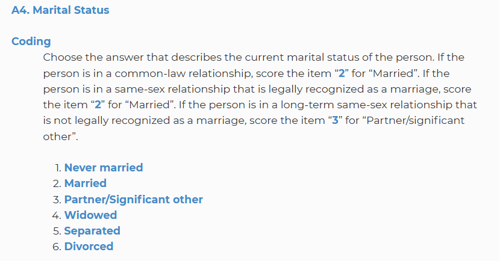

### CAP manual

The CAP manual should be considered separately, as it has some peculiarities that could result in considerable differences between formats:

-   The floating window where the 'Manual' tab is placed (along with the 'Results' and 'Compare' tabs) is placed on the center of the browser page and is much wider than the panel on the right, where the manual for the assessment questions is placed on the assessment view. For the user, this means that the text paragraphs are wider horizontally (as there is more room for displaying longer sentences) but shorter vertically.
-   The blocks of text are more visible as separate units, compared to the manual panel, where sometimes a long paragraph can take all the visible space on the page, making it impossible to know where it starts or ends. In the CAP view, as the window is wider, the paragraphs usually have visible boundaries, making it easier to consider each paragraph as a separate unit.
-   The importance of these features lies in the fact that when formatting the CAP manual, the paragraphs within the same section should not be separated from each other by a double break mark `<br><br>` as this would make it difficult to see the limits of the sections within the CAP manual; furthermore making the resulting presentation unnecessarily long. A single `<br>` symbol is enough to mark the end of a paragraph and the beginning of the next.
-   Note that the main sections of the document (Problem, Triggers and Guidelines) should be rendered with the `<h3></h3>` tag. This makes it easier to spot each section as a separate block.
-   The 'Overall Goals of Care' should be inside a table along these lines `<div align="center"><table border="1" rules="none"><tbody></tbody></table></div>`

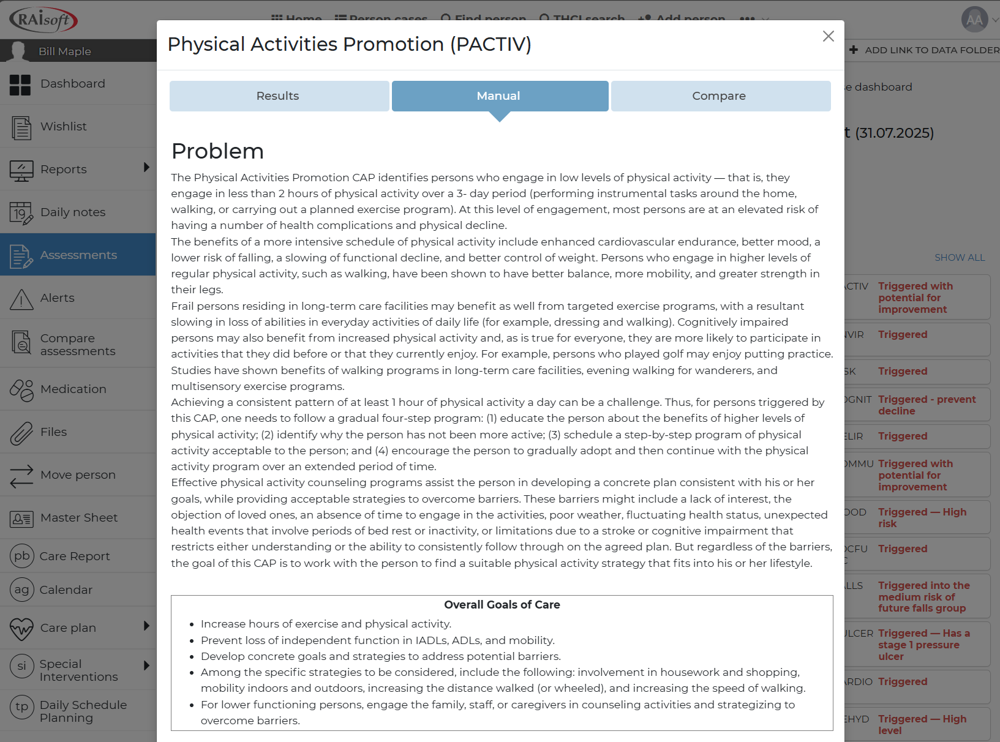

-   There are sections clearly limited which follow a similar structure in most of the CAPs. These sections should have the headings formatted with the `<h3></h3>` tag.

-   The headings for each subsection, have the opening title in bold and the paragraph directly underneath. It is not recommended to leave a double space `<br><br>` right after the title in bold and before the paragraph as this would make visually separating the paragraphs more difficult. However, paragraphs with opening titles in bold (subsection) should be two 'break' spaces apart `<br><br>`.

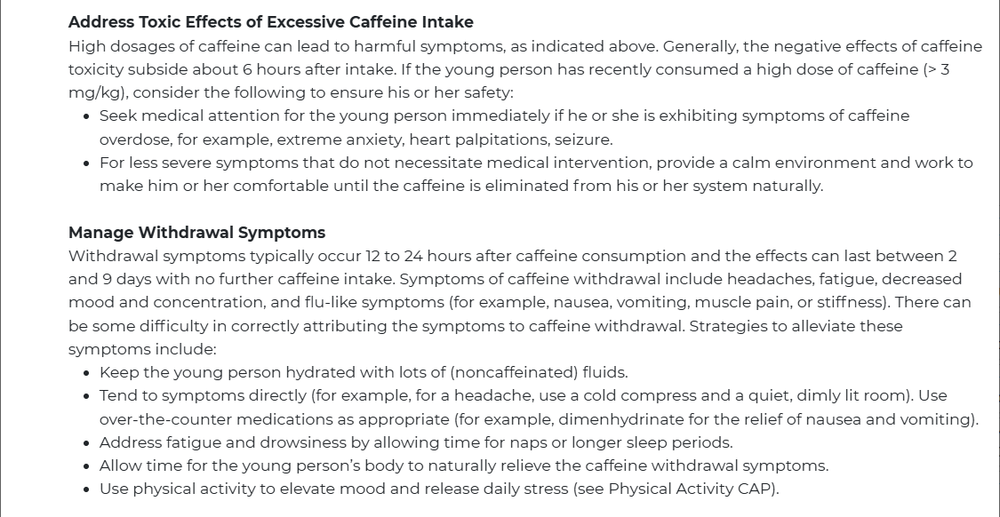

-   The 'Triggers' section should not be nested, with the 'TRIGGERED' and 'NOT TRIGGERED' subsection in capitals and bold font.

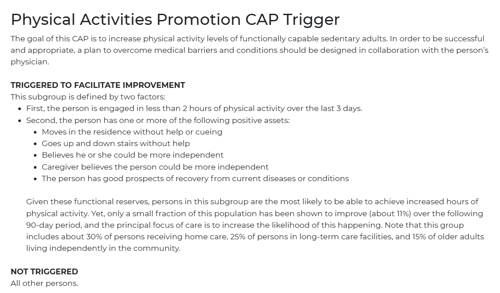

-   The 'Additional Resources' title should be in bold and not nested, but the section itself should be nested.
-   The 'Authors' section should be centered inside a table (both the title and the authors), with the title of the section in bold, but the authors themselves should not be in bold font.

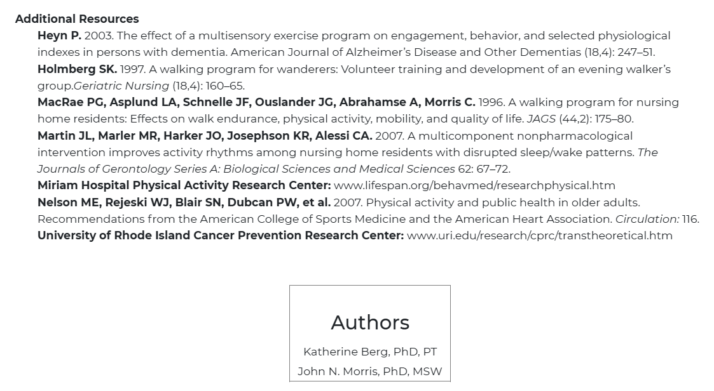

-   The main title of the CAP manual is always visible at the top of the page, even when scrolling down. For that reason, it is important that the headings or sub-headings do not use the `<h2></h2>` (or greater) tag, as this makes the title loose prominence:

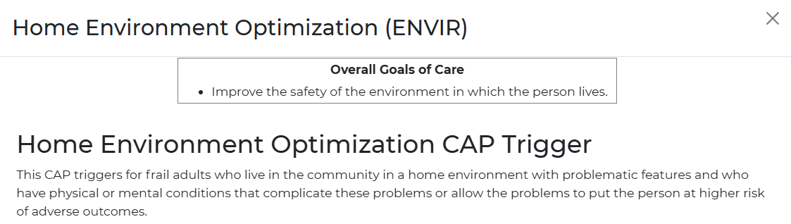

### Conventions to facilitate reading

This section aims to set a standard to avoid text cluttering or lack of spacing between orthographic symbols which makes the manual harder to read.

-   Words joined by the forward slash character `/`

::: callout-note
This happens when the manual makes a reference to terms that have a close relationship and could be easily interchanged. This is usually conveyed by joining the words without spaces with a `/` character.
:::

¦Examples: 'Continuing care hospital/unit' 'Hospice facility/palliative care unit'

::: callout-important
It is recommended to leave a space before and after the `/` character. So the previous examples would look like this:
:::

¦Corrected examples: 'Continuing care hospital / unit' 'Hospice facility / palliative care unit'

-   Words in bold on the original manual shown in normal font or vice versa

::: callout-note
Some words, like the author's list in the screenshot before, will be copied with normal font even if shown in bold on the original manual. This is also intended for clarity. Likewise, words that are not in bold on the original manual (like 'Trigger') get transcribed in bold to set the limits of a section.
:::

-   Lists with short sentences vs lists with long sentences

::: callout-tip
When transcribing ordered lists, it is recommended not to use the `<ol></ol>` format unless strictly necessary, as mentioned before. It is also important to separate short sentences with just one `<br>` space, but use two `<br><br>` spaces for longer sentences. This renders the long blocks of text neatly separated.
:::

¦Example of a list with short sentences:

``` html
<b>Coding</b>
<div style="padding-left:3em;">
<b>0. 	Never</b><br>
<b>1. 	More than 30 days ago</b><br>
<b>2. 	8 to 30 days ago</b><br>
<b>3. 	4 to 7 days ago</b><br>
<b>4. 	In last 3 days</b><br>
<b>8. 	Unable to determine</b>
<br><br>
```

¦Output:


¦Example of a list with long sentences:

``` html
<b>Coding</b>
<div style="padding-left:3em;">
<b>0. 	No decline</b> — There was no change or there was an increase in the person’s level of participation in social activities.
<br><br>

<b>1. 	Decline, not distressed</b> — The person experienced a decline in his or her level of participation in social activities without a corresponding increase in his or her distress.
<br><br>

<b>2.	Decline, distressed</b> — Both decline and distress are observed or reported.
</div>
```

¦Output:


### Availability of the interRAI instruments with CAP output in our main customer base

| **interRAI Instrument** | **Finland** | **Switzerland** | **Canada** |
|---------------------|-----------------|-----------------|-----------------|
| Home Care (HC) | YES | YES | YES |
| Long-Term Care Facilities (LTCF) | YES | YES | YES |
| Acute Care (AC-CGA) | NO | YES | YES |
| Palliative Care (PC) | NO | NO | YES |
| Mental Health (MH) | YES | YES | YES |
| Child & Youth Mental Health (ChYMH) | YES | NO | YES |
| Intellectual Disability (ID) | YES | YES | YES |
| Emergency Department Screener (ED) | YES | YES | YES |
| Community Mental Health (CMH) | YES | YES | YES |
| Children & Youth MH + Developmental Disabilities | YES | NO | YES |

##################################################################################################################################################################################################################################################################################################################################################################### 

## SmartyPants

SmartyPants converts ASCII punctuation characters into "smart" typographic punctuation HTML entities. For example:

|   | ASCII | HTML |
|------------------|---------------------------|---------------------------|
| Single backticks | `'Isn't this fun?'` | 'Isn't this fun?' |
| Quotes | `"Isn't this fun?"` | "Isn't this fun?" |
| Dashes | `-- is en-dash, --- is em-dash` | -- is en-dash, --- is em-dash |

## KaTeX

You can render LaTeX mathematical expressions using [KaTeX](https://khan.github.io/KaTeX/):

The *Gamma function* satisfying $\Gamma(n) = (n-1)!\quad\forall n\in\mathbb N$ is via the Euler integral

$$
\Gamma(z) = \int_0^\infty t^{z-1}e^{-t}dt\,.
$$

> You can find more information about **LaTeX** mathematical expressions [here](http://meta.math.stackexchange.com/questions/5020/mathjax-basic-tutorial-and-quick-reference).

## UML diagrams

You can render UML diagrams using [Mermaid](https://mermaidjs.github.io/). For example, this will produce a sequence diagram:


``` markdown
sequenceDiagram
Alice ->> Bob: Hello Bob, how are you?
Bob-->>John: How about you John?
Bob--x Alice: I am good thanks!
Bob-x John: I am good thanks!
Note right of John: John thinks a long<br/>long time, so long<br/>that the text does<br/>not fit on a row.

Bob-->Alice: Checking with John...
Alice->John: Yes... John, how are you?
```

::: {.content-visible when-format="html"}
```{mermaid}
sequenceDiagram
Alice ->> Bob: Hello Bob, how are you?
Bob-->>John: How about you John?
Bob--x Alice: I am good thanks!
Bob-x John: I am good thanks!
Note right of John: John thinks a long<br/>long time, so long<br/>that the text does<br/>not fit on a row.

Bob-->Alice: Checking with John...
Alice->John: Yes... John, how are you?
```

:::

::: {.content-visible unless-format="html"}

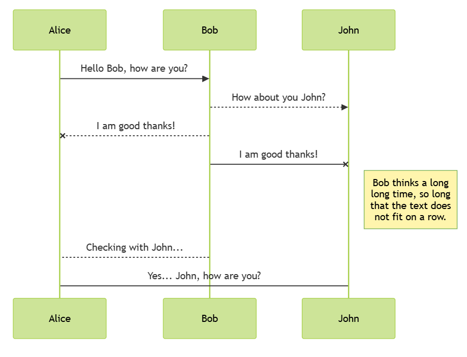

:::

\pagebreak
And this will produce a flow chart:

``` markdown
sequenceDiagram
graph LR
A[Square Rect] -- Link text --> B((Circle))
A --> C(Round Rect)
B --> D{Rhombus}
C --> D
```


```{mermaid}
graph LR
A[Square Rect] -- Link text --> B((Circle))
A --> C(Round Rect)
B --> D{Rhombus}
C --> D
```


::: callout-note
Note that there are five types of callouts, including: note, tip, warning, caution, and important.
:::

::: callout-warning
Callouts provide a simple way to attract attention, for example, to this warning.
:::

::: callout-important
Danger, callouts will really improve your writing.
:::

::: {.callout-tip title="Helpful Tip"}
This is an example of a callout with a custom title.
:::

::: callout
This is a default callout with no type specified.
:::


## Expand To Learn About Collapse

::: {.callout-caution collapse="true"}

This is an example of a 'folded' caution callout that can be expanded by the user. You can use `collapse="true"` to collapse it by default or `collapse="false"` to make a collapsible callout that is expanded by default.
:::

